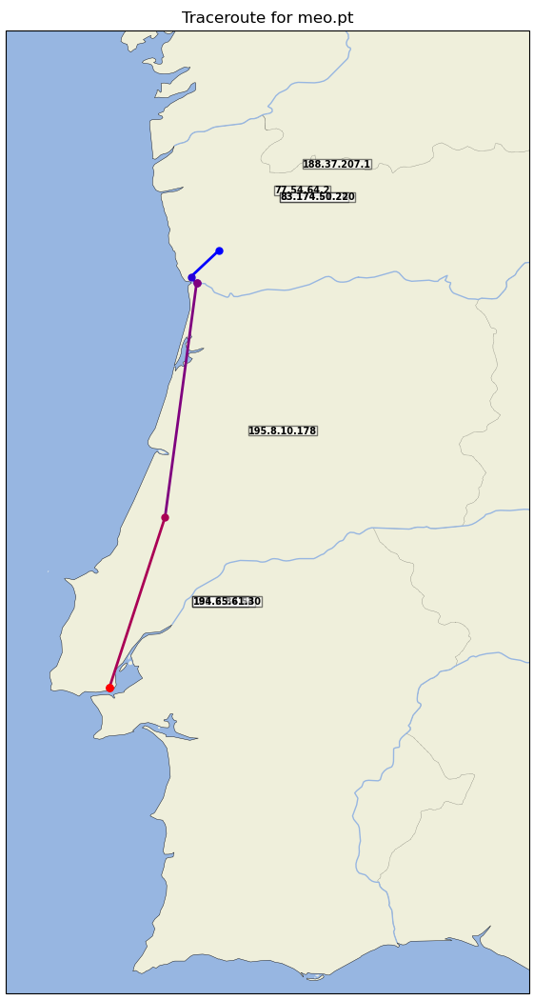

# GeoTraceroute


GeoTraceroute is a Python utility that visualizes the geographic path of an internet traceroute. It maps the IP addresses of each hop to their physical latitude and longitude and plots the complete path over a world map.

This tool is excellent for network diagnostics, education, or simply for curiosity about how data travels across the internet.



## 🌍 Features

* **Geographic IP Resolution:** Uses the [ip-api.com](http://ip-api.com/) service to find the latitude and longitude of each IP address.
* **Smart Caching:** Caches API results in `cache.json` to speed up subsequent requests and stay within API limits.
* **Interactive Map:** Renders the path on an interactive [Matplotlib](https://matplotlib.org/) map, powered by [Cartopy](https://scitools.org.uk/cartopy/).
* **Dynamic Path Coloring:** The path is drawn with a color gradient (blue to red) to show the direction of data flow.
* **IP Labels:** Each hop (node) on the map is labeled with its IP address.

## ⚙️ How It Works

1.  **Traceroute:** The script runs the system's native `traceroute` command to a target URL or IP.
2.  **IP Parsing:** It parses the output to extract the IP address of each hop.
3.  **Geolocation:** For each IP, it calls the `resolve_ip` function, which:
    * Checks a local `cache.json` for a fresh (less than 1 hour old) entry.
    * If no valid cache entry exists, it fetches the geo-data from `ip-api.com`.
    * Saves the new data to the cache.
4.  **Plotting:** Finally, it uses Cartopy and Matplotlib to plot all valid coordinates (latitude/longitude), drawing lines and markers for the path.

## 📦 Installation

This project requires Python 3 and several external libraries.

1.  **Clone the repository:**
    ```bash
    git clone [https://github.com/YOUR_USERNAME/geotraceroute.git](https://github.com/YOUR_USERNAME/geotraceroute.git)
    cd geotraceroute
    ```

2.  **Install system dependencies:**
    Cartopy has system-level dependencies that must be installed first.

    * **On Debian/Ubuntu:**
        ```bash
        sudo apt-get install libproj-dev proj-data proj-bin libgeos-dev
        ```
    * **On Red Hat/CentOS:**
        ```bash
        sudo dnf install proj proj-devel geos-devel
        ```
    * **On macOS (using Homebrew):**
        ```bash
        brew install proj geos
        ```

3.  **Install Python dependencies:**
    A `requirements.txt` file is provided for all Python packages.
    ```bash
    python3 -m venv venv
    source venv/bin/activate
    pip install -r requirements.txt
    ```

## 🚀 Usage

You can run the script from the command line, passing one or more URLs or IP addresses as arguments.

```bash
./geotraceroute.py google.com
```

You can also trace multiple targets in one go:

```bash
./geotraceroute.py google.com bbc.co.uk 8.8.8.8
```

The script will open an interactive Matplotlib window for each target.

## 📄 License

This project is licensed under the MIT License. See the [LICENSE](LICENSE) file for details.

## 🧑‍💻 Author

* **Mário Antunes** - [mario.antunes@ua.pt](mailto:mario.antunes@ua.pt)
